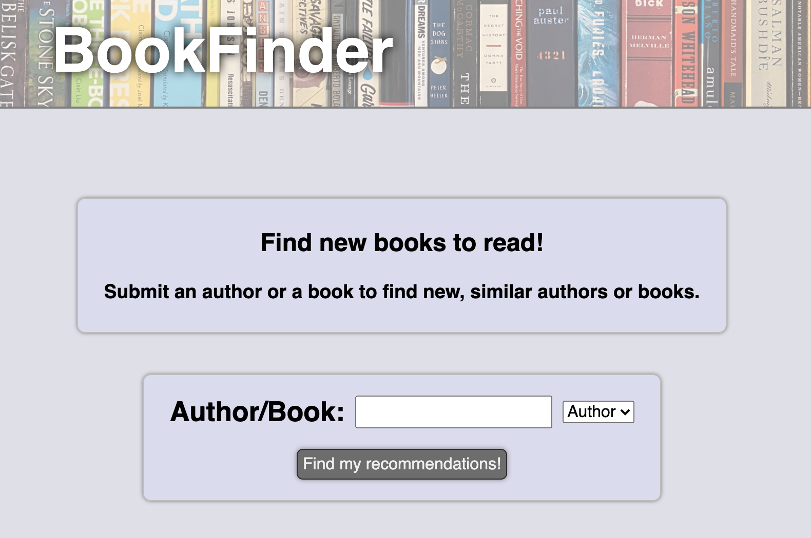
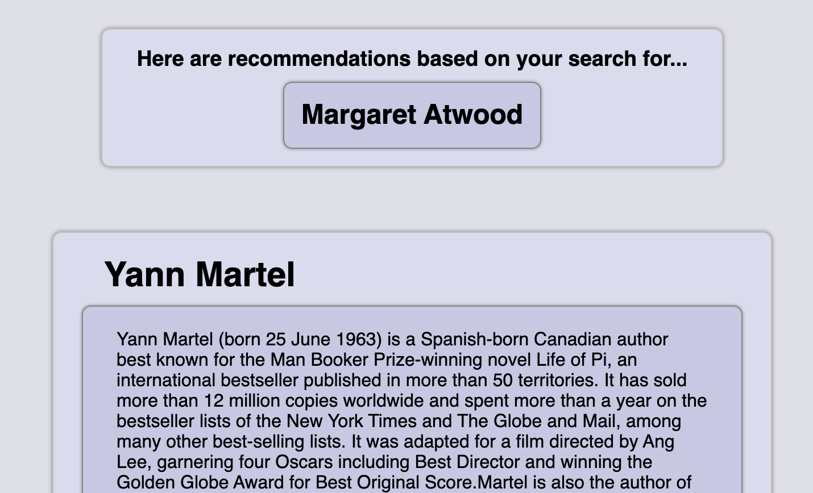
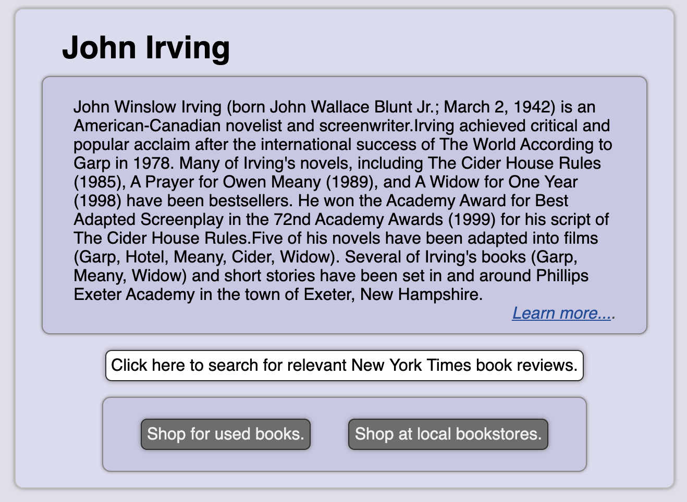
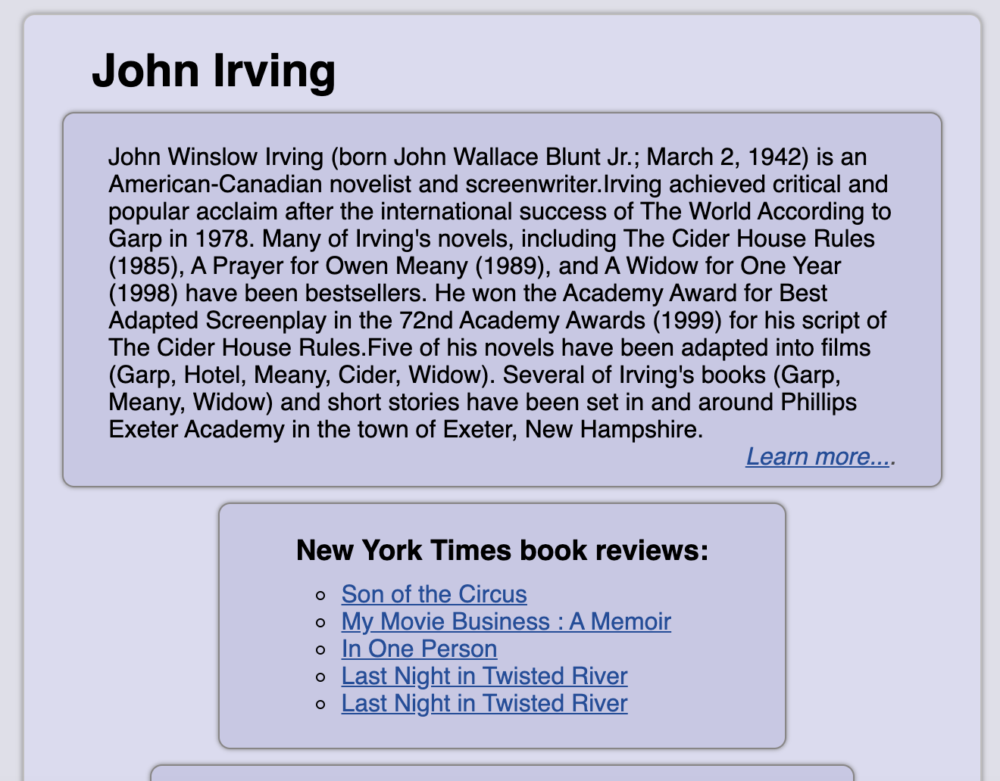
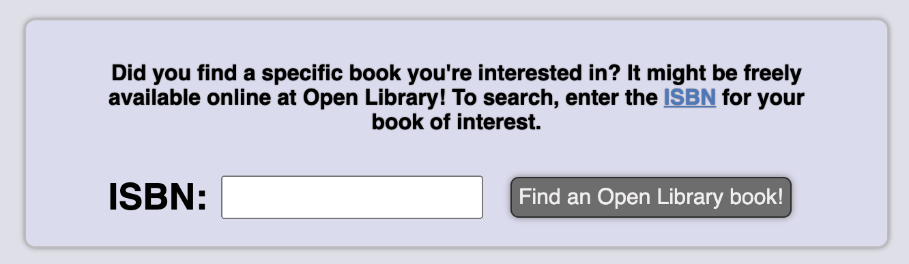

# BookFinder App

Use the GitHub-hosted app [here](https://sam1cutler.github.io/BookFinder/).

## General Description
This online tool will allow users to submit books and authors they know they like, and then get corresponding book and author recommendations.

## Summary
The user begins by entering a book or author they like:

Next, the app will use the [TasteDive API](https://tastedive.com/) to curate a list of recommendations, along with brief summaries pulled from Wikipedia and links to corresponding Wikipedia entries, when that info is available in the TasteDive API results.

In addition, users will have the option to click a button that will generate a list of New York Times book reviews, generated using the [NYTimes Books API](https://developer.nytimes.com/docs/books-product/1/overview). 

If the user is interested in the book or author, they will be able to click on buttons that will directly link them to relevant searches on either [Indiebound](https://www.indiebound.org/) (if the user wants to buy from a local book store) or [Alibris](https://www.alibris.com/) (if the user wants to look for used copies).

Finally, at the end of the list of search results, there will be a window inviting users to input the ISBN of any specific book they're interested in, which will allow them to check whether the book is available for free through [Open Library](https://openlibrary.org/), which will involve use of the [Open Library API](https://openlibrary.org/dev/docs/api/books).

## Technology used
This project is built with HTML, CSS, Javascript, and jQuery. 

## Contact me
You can find [my GitHub page here](https://github.com/sam1cutler).

## Acknowledgements
This project was completed as part of the Thinkful full-stack engineering program. 
